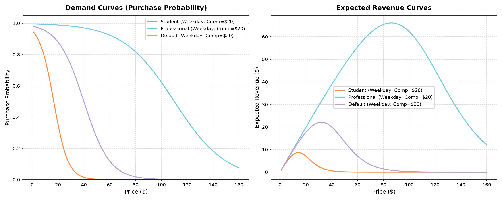
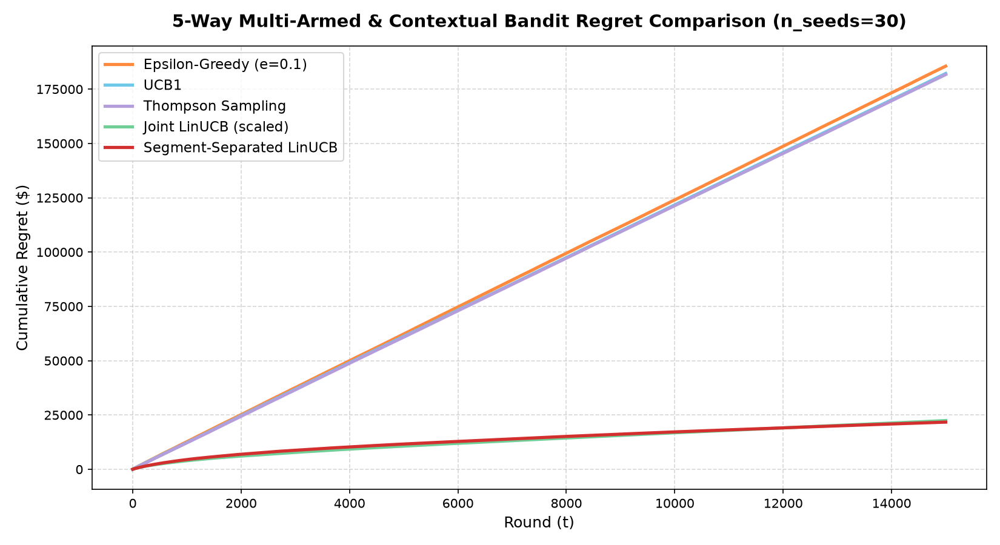
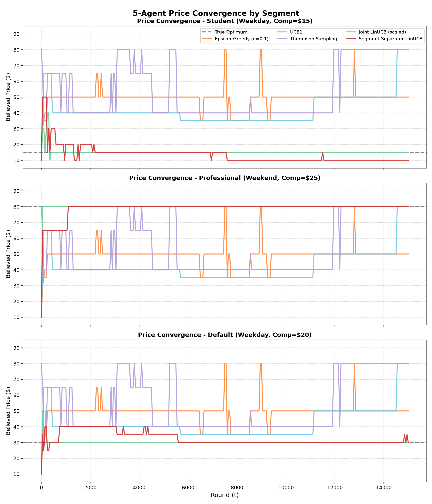
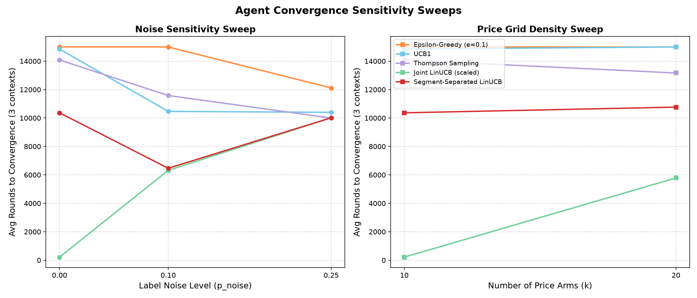

# Vantage: Personalized Dynamic Pricing Engine

Vantage is a production-grade personalized dynamic pricing engine designed to optimize product pricing in real-time. It leverages advanced reinforcement learning and bandit algorithms to personalize pricing strategies for distinct customer segments under varying context conditions (such as weekday vs. weekend patterns and competitor pricing).

The system transitions from standard point-estimate baseline models to context-aware linear reward models, achieving optimal revenue generation while minimizing cumulative regret.

---

## 🚀 System Architecture & Agent Roster

The core engine supports five different pricing bandit agents under a unified interface:

1. **Epsilon-Greedy** (`EpsilonGreedy`): Evaluates prices based on a running average reward (revenue) estimate, exploring randomly with probability $\epsilon$.
2. **UCB1** (`UCB1`): A standard multi-armed bandit that balances exploration and exploitation using an upper confidence bound based on Chernoff-Hoeffding bounds. Corrected to track conversion probabilities and price-scale updates.
3. **Thompson Sampling** (`ThompsonSampling`): A Bayesian agent using Beta-Bernoulli conjugate priors to maintain a full probability distribution over purchase conversions, selecting prices using price-scaled posterior sampling.
4. **Joint LinUCB** (`LinUCB`): A contextual linear bandit that models expected revenue as a linear function of a 5-dimensional context vector, utilizing Ridge regression and a price-scaled exploration confidence ellipsoid.
5. **Segment-Separated LinUCB** (`SegmentSeparatedLinUCB`): A contextual agent that instantiates separate LinUCB instances per customer segment (Student, Professional, Default) to eliminate cross-segment parameter poisoning.

---

## 📊 Detailed Visual Tour & Optimization Theory

Below is a detailed walkthrough of the pricing environment, algorithmic behavior, and convergence characteristics mapped to the visualizations generated by the engine.

### 1. Market Demand & Expected Revenue curves
Vantage models a single customer interaction as a Bernoulli trial where the purchase probability follows a sigmoid function of price and context:
$$P(\text{purchase} \mid \text{price}, \text{context}) = \sigma(\beta_0 - \beta_{\text{price}} \cdot \text{price})$$
where the intercept $\beta_0$ and price sensitivity $\beta_{\text{price}}$ are linear combinations of the customer context vector (encoding segment, day type, and competitor price).

Our continuous bounds solver finds the optimal expected revenue peak for each segment:
* **Student Segment** (highly price-sensitive): Peaks at a lower price ($\approx \$13.38$).
* **Professional Segment** (willingness to pay is high): Peaks at a higher price ($\approx \$97.83$).
* **Default Segment**: Peaks in the middle ($\approx \$32.08$).

The plot below shows how the demand (purchase probability) decays as price rises, and how the expected revenue curves peak at different prices depending on the segment:



---

### 2. Multi-Agent Regret Comparison
To evaluate performance, we measure **cumulative regret**, defined as the running sum of the difference between the optimal expected revenue (the best action for that round's context) and the expected revenue of the chosen price:
$$\text{CumRegret}(T) = \sum_{t=1}^{T} \left( R(p^*_t) - R(p_t) \right)$$

* **Linear Regret Growth (Baseline Bandits)**: Epsilon-Greedy, UCB1, and Thompson Sampling are non-contextual. They are forced to learn a single "global compromise price" across all incoming customer contexts. As a result, they accrue constant linear regret on the Student and Professional segments because they cannot personalize.
* **Sub-linear Regret Growth (Contextual Bandits)**: Both Joint LinUCB and Segment-Separated LinUCB are context-aware. They learn to personalize the price to the customer context vector. Their cumulative regret curves flatten logarithmically (sub-linear regret) as they converge on the optimal policy, saving nearly **10x** in lost revenue over 15,000 rounds.



---

### 3. Price Convergence Diagnostics
We track each agent's greedy pricing beliefs over time against the segment-specific optimal price:
* **Personalized Convergence**: Both contextual LinUCB variants diverge by segment, converging to $\$15$ for students, $\$80$ for professionals (the closest prices on the discrete grid to the continuous peaks), and $\$30$ for default customers.
* **Compromise Lock-in**: Non-contextual agents (such as UCB1 and Thompson Sampling) cannot segment. They settle on a single compromise price globally (around $\$80$ or $\$50$) for all customers, failing to capture Student and Default demand.

Additionally, standard Joint LinUCB was patched to prevent **cross-segment poisoning**, which occurs when zero-reward pulls from price-sensitive students contaminate the shared parameter matrices of high-price arms, permanently locking professionals out. The isolated segment design of Segment-Separated LinUCB avoids this entirely.



---

### 4. Algorithmic Sensitivity Sweeps
We verify the robustness of convergence speed across two sweeps:
* **Label Noise Sweep**: We inject binary symmetric label noise ($p_{\text{noise}} \in \{0.0, 0.1, 0.25\}$) into purchase outcomes. As noise increases, convergence rounds rise because the signal-to-noise ratio drops, requiring more pulls to distinguish the true expected revenue peak.
* **Price Grid Density Sweep**: We expand the price grid from 10 arms to 20 arms (making the action space twice as dense). The convergence speed slows down for Joint LinUCB because the exploration search space is larger. Non-contextual agents remain unable to converge across segments.



---

## 📂 Repository Layout

```filepath
Vantage/
├── src/vantage/
│   ├── schemas.py              # Customer context & data model schemas
│   ├── tools/
│   │   ├── simulator.py        # Bernoulli market simulator & context sampler
│   │   └── optimization.py    # SciPy numerical bounds solver & optimal revenue calculations
│   └── agents/
│       ├── __init__.py         # Module exports
│       ├── bandit_agents.py    # Epsilon-Greedy, UCB1 baseline classes
│       ├── thompson_sampling.py# Thompson Sampling Bayesian implementation
│       └── linucb_agent.py     # Disjoint and Segment-Separated LinUCB implementations
├── scripts/
│   ├── new_evaluate_all_agents.py # 5-way regret comparison, convergence, & sensitivity sweeps
│   ├── evaluate_bandit_agents.py  # Regret evaluation script
│   ├── evaluate_linucb.py         # Convergence evaluation script
│   └── generate_ground_truth.py   # Ground-truth table compiler
└── tests/
    ├── test_simulator.py       # Simulator validation tests
    ├── test_optimization.py    # SciPy optimizer tests
    ├── test_bandit_agents.py   # EpsilonGreedy & UCB1 test suite
    ├── test_thompson_sampling.py# Thompson Sampling test suite
    └── test_linucb_agent.py    # LinUCB & Segment-Separated LinUCB test suite
```

---

## 🔧 Installation & Verification

### Prerequisites
Make sure Python is installed. We recommend using standard `pip` or `uv` inside a virtual environment.

### Setup
```bash
# Clone the repository
git clone https://github.com/shivansh-magnus/vantage.git
cd vantage

# Create and activate virtual environment
python -m venv .venv
source .venv/bin/activate  # On Windows: .venv\Scripts\activate

# Install dependencies
pip install -e .
```

### Running Tests
Execute the unit and integration test suite to verify the mathematical updates, routing logic, and regret boundaries:
```bash
pytest
```

### Running Evaluations
Run the full 5-way simulation harness to perform regret analysis, convergence diagnostics, and sensitivity sweeps, generating the comparison plots under `runs/`:
```bash
python scripts/new_evaluate_all_agents.py
```
